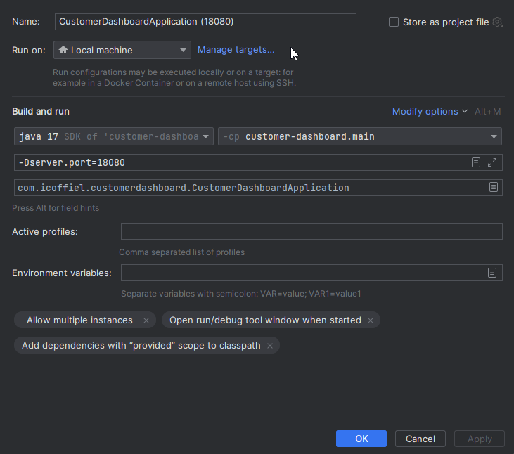

# Customer Dashboard

## Overview

This shows how to use Kafka to return a dashboard.

There are 2 topics:
- `customer_events`
- `customer`

The `customer_events` topic is a stream of individual customer events similar to an audit log

The `customer` topic is a stream of individual customers and is compacted meaning the latest key is kept when cleanup occurs

A Global KTable is created that stores the customer data and allows access across partitions

## Running

1. Startup Kafka
    ```shell
    cd .docker
    docker-compose up -d
    ```

2. Run the application. The following uses an IntelliJ configuration. It's important to set the `server.port` if you want to run more than 1 instance

   

## Issues

```
Encountered a topic-partition not associated with any global state store
```

This is caused by changes happening to the state store that have hung around locally

See https://stackoverflow.com/questions/64914339/globalktable-streamsexception-encountered-a-topic-partition-not-associated-wi

Can be fixed by deleting the state dir which is defined in application.yaml file:

```yaml
spring:
  kafka:
    streams:
      state-dir: ${java.io.tmpdir}kafka-streams${file.separator}${server.port}
```